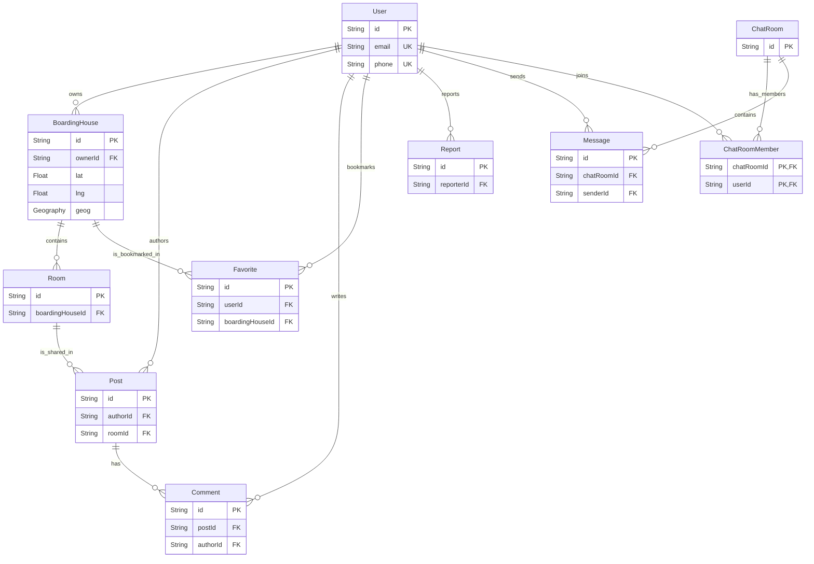

# TÀI LIỆU ĐẶC TẢ CƠ SỞ DỮ LIỆU (DATABASE SPECIFICATION)

**Dự án:** Mạng xã hội tìm phòng trọ
**Phiên bản:** 1.0 (Phù hợp với Project Plan V2 và Kiến trúc Phần mềm)

Tài liệu này đóng vai trò là "Single Source of Truth" (Nguồn chân lý duy nhất) cho toàn bộ thiết kế dữ liệu trước khi ánh xạ vào mã nguồn (Prisma Schema) hay cơ sở dữ liệu (PostgreSQL). 

---

## 1. ER Diagram (Sơ đồ thực thể liên kết)

---

## 2. Tiêu chuẩn thiết kế chung (General Conventions)

- **Primary Key (PK)**: Sử dụng chuỗi UUID (v4) cho tất cả các bảng. Tránh lộ thứ tự bản ghi như Auto Increment (ID 1, 2, 3), giúp bảo mật dữ liệu và hỗ trợ tốt cho kiến trúc phân tán.
- **Audit Fields**: 100% các bảng dữ liệu nghiệp vụ chính đều có `createdAt` và `updatedAt`.
- **Soft Delete**: Các bảng chứa dữ liệu sinh ra từ User (như phòng trọ, bài đăng, comment) đều có trường `deletedAt`. Khi người dùng bấm xoá, dữ liệu chỉ ẩn đi (đặt deletedAt = thời gian hiện tại) để phục vụ cho việc khôi phục (nếu cần) hoặc đối soát khi có tranh chấp/báo cáo xấu.
- **Foreign Key Cascade**: Thiết kế theo nguyên tắc bảo vệ dữ liệu (Restrict) để tránh vô tình xóa hàng loạt dữ liệu quan trọng, nhưng linh hoạt (Cascade) đối với dữ liệu rác (ví dụ xóa Bài viết thì tự xóa Bình luận).

---

## 3. Thiết kế chi tiết từng bảng

### 3.1. Bảng `User`
**Mục đích:** Lưu trữ thông tin định danh và hồ sơ người dùng (Tenant, Landlord, Admin). Đồng bộ một chiều từ Supabase Auth sang.

| Tên trường | Data Type | PK/FK | Default / Constraint | Giải thích |
|---|---|---|---|---|
| `id` | String | PK | | Đồng bộ 1-1 với `auth.users.id` từ Supabase. |
| `email` | String | | UNIQUE | Đăng nhập chính. |
| `phone` | String | | UNIQUE, Nullable | Bắt buộc khi hoàn thiện hồ sơ. |
| `fullName` | String | | Nullable | Tên hiển thị. |
| `cccd` | String | | Nullable | Chỉ phục vụ lưu trữ, không bắt buộc xác thực. |
| `bio` | String | | Nullable | Giới thiệu bản thân. |
| `avatarUrl` | String | | Nullable | Link ảnh Supabase Storage. |
| `role` | Enum | | Default: 'TENANT' | 'TENANT', 'LANDLORD', 'ADMIN'. |
| `isActive` | Boolean | | Default: true | Dùng cho Admin ban/unban người dùng. |
| `isProfileComplete`| Boolean| | Default: false | Check xem user đã điền sđt/tên ở lần đăng nhập đầu chưa. |
| `createdAt` | DateTime| | Default: Now | Audit. |
| `updatedAt` | DateTime| | Auto update | Audit. |
| `deletedAt` | DateTime| | Nullable | Soft delete (Khi user muốn xoá tài khoản). |

- **Indexes:** 
  - Index trên `email` (Unique Index - tạo tự động).
  - Index trên `phone` (Unique Index - tạo tự động).
  - Index trên `role` để Admin dễ dàng lọc danh sách.

### 3.2. Bảng `BoardingHouse` (Nhà trọ)
**Mục đích:** Định danh một tòa nhà / địa chỉ khu trọ (có thể có nhiều phòng). Chủ yếu để nhóm các phòng lại và xác định toạ độ trên bản đồ.

| Tên trường | Data Type | PK/FK | Default / Constraint | Giải thích |
|---|---|---|---|---|
| `id` | String | PK | UUID | |
| `ownerId` | String | FK | Refs: `User(id)` | Khóa ngoại tới Chủ trọ. |
| `name` | String | | | Tên toà nhà / khu trọ. |
| `address` | String | | | Số nhà, đường. |
| `ward` | String | | Nullable | Phường/Xã (để lọc text). |
| `district` | String | | Nullable | Quận/Huyện (để lọc text). |
| `city` | String | | Nullable | Tỉnh/Thành phố (để lọc text). |
| `lat` | Float | | | Vĩ độ (chỉ dùng trả về FE). |
| `lng` | Float | | | Kinh độ (chỉ dùng trả về FE). |
| `geog` | Geography| | Point, SRID 4326 | Kiểu dữ liệu đặc thù của PostGIS dùng để tính khoảng cách không gian (Spatial Queries). |
| `description`| String | | Nullable | Mô tả chung toàn bộ toà nhà. |
| `createdAt` | DateTime| | Default: Now | Audit. |
| `updatedAt` | DateTime| | Auto update | Audit. |
| `deletedAt` | DateTime| | Nullable | Soft delete. |

- **Indexes:**
  - GIST Index trên `geog`: Rất quan trọng, bắt buộc phải có để các truy vấn tìm kiếm bằng `ST_DWithin` (tìm xung quanh vị trí) chạy nhanh trong thời gian thực.
  - B-tree Index trên `ownerId`.
- **Cascade Rule:** `ownerId` (Restrict) - Không cho phép xoá tài khoản chủ trọ nếu họ vẫn còn nhà trọ đang hoạt động. Cần chủ trọ tự xoá/ẩn nhà trọ trước.

### 3.3. Bảng `Room` (Phòng trọ)
**Mục đích:** Lưu thông tin chi tiết của từng phòng trong một nhà trọ. Đây là entity chính người thuê trọ sẽ xem và ra quyết định.

| Tên trường | Data Type | PK/FK | Default / Constraint | Giải thích |
|---|---|---|---|---|
| `id` | String | PK | UUID | |
| `boardingHouseId`| String | FK | Refs: `BoardingHouse(id)`| Thuộc nhà trọ nào. |
| `roomCode` | String | | | Ký hiệu phòng (VD: P101, Tầng 2). |
| `status` | Enum | | Default: 'AVAILABLE' | 'AVAILABLE', 'OCCUPIED'. |
| `price` | Float | | | Giá tiền (VNĐ/tháng). |
| `area` | Float | | | Diện tích (m2). |
| `maxOccupants`| Int | | Nullable | Số người tối đa cho phép. |
| `amenities` | JSON | | Nullable | Mảng chuỗi: ["wifi", "máy lạnh", "chỗ để xe"]. |
| `content` | String | | Nullable | Mô tả chi tiết phòng. |
| `images` | JSON | | Nullable | Mảng các đường link (URLs) ảnh chụp. |
| `createdAt` | DateTime| | Default: Now | Audit. |
| `updatedAt` | DateTime| | Auto update | Audit. |
| `deletedAt` | DateTime| | Nullable | Soft delete. |

- **Indexes:**
  - Index trên `boardingHouseId`.
  - Index trên `price` (để hỗ trợ bộ lọc khoảng giá nhanh hơn).
  - Index trên `status` (thường xuyên truy vấn lấy các phòng AVAILABLE).
- **Cascade Rule:** `boardingHouseId` (Cascade). Nếu nhà trọ bị xoá vật lý, tất cả phòng trọ bên trong sẽ biến mất. Tuy nhiên do nhà trọ đang dùng Soft Delete, hành vi này ít xảy ra.

### 3.4. Bảng `Post` (Bài đăng diễn đàn)
**Mục đích:** Nền tảng chia sẻ thông tin cộng đồng. Hỗ trợ dạng Thảo luận chung hoặc Chia sẻ trực tiếp phòng trọ từ hệ thống.

| Tên trường | Data Type | PK/FK | Default / Constraint | Giải thích |
|---|---|---|---|---|
| `id` | String | PK | UUID | |
| `authorId` | String | FK | Refs: `User(id)` | Tác giả. |
| `roomId` | String | FK | Refs: `Room(id)`, Nullable | Khóa ngoại tới Phòng trọ (nếu là bài share phòng). |
| `type` | Enum | | Default: 'DISCUSSION' | 'DISCUSSION' hoặc 'ROOM_SHARE'. |
| `title` | String | | | Tiêu đề bài viết. |
| `content` | String | | | Nội dung chi tiết (hỗ trợ text dài). |
| `images` | JSON | | Nullable | Mảng ảnh đính kèm (cho bài discussion). |
| `isPublished`| Boolean | | Default: true | Dùng để Admin ẩn bài thay vì xoá (kiểm duyệt). |
| `createdAt` | DateTime| | Default: Now | Audit. |
| `updatedAt` | DateTime| | Auto update | Audit. |
| `deletedAt` | DateTime| | Nullable | Soft delete. |

- **Indexes:**
  - Index trên `authorId`.
  - Index trên `roomId`.
  - Index sắp xếp trên `createdAt` DESC để lấy feed diễn đàn nhanh nhất.
- **Cascade Rule:**
  - `authorId` (Restrict).
  - `roomId` (Set Null): Nếu phòng trọ bị xoá vĩnh viễn, bài post vẫn còn nhưng mất link liên kết tới phòng (không bị xoá theo).

### 3.5. Bảng `Comment` (Bình luận)
**Mục đích:** Tương tác dưới mỗi bài đăng.

| Tên trường | Data Type | PK/FK | Default / Constraint | Giải thích |
|---|---|---|---|---|
| `id` | String | PK | UUID | |
| `postId` | String | FK | Refs: `Post(id)` | |
| `authorId` | String | FK | Refs: `User(id)` | |
| `content` | String | | | |
| `createdAt` | DateTime| | Default: Now | Audit. |
| `updatedAt` | DateTime| | Auto update | Audit. |
| `deletedAt` | DateTime| | Nullable | Soft delete (cho phép người dùng thu hồi bình luận). |

- **Cascade Rule:** `postId` (Cascade). Nếu Bài đăng bị xóa vĩnh viễn, xóa tất cả bình luận rác theo nó.

### 3.6. Bảng `ChatRoom` & `ChatRoomMember` (Phòng Chat & Thành Viên)
**Mục đích:** Quản lý hội thoại chat 1-1. Tách làm hai bảng để mô phỏng chuẩn kiến trúc chat, giúp sau này nếu cần làm Chat Group thì thiết kế vẫn đáp ứng được.

#### Bảng `ChatRoom`
| Tên trường | Data Type | PK/FK | Default / Constraint | Giải thích |
|---|---|---|---|---|
| `id` | String | PK | UUID | |
| `type` | Enum | | Default: 'DIRECT' | Loại phòng. Dù MVP chỉ có DIRECT (1-1) nhưng Enum này giúp mở rộng sau. |
| `createdAt` | DateTime| | Default: Now | |

#### Bảng `ChatRoomMember` (Junction Table)
| Tên trường | Data Type | PK/FK | Default / Constraint | Giải thích |
|---|---|---|---|---|
| `chatRoomId` | String | PK,FK | Refs: `ChatRoom(id)` | Thuộc tính của Composite Key. |
| `userId` | String | PK,FK | Refs: `User(id)` | Thuộc tính của Composite Key. |
| `joinedAt` | DateTime| | Default: Now | Thời gian tham gia. |

- **PK Rule:** Dùng Composite Key (Khóa chính kép) bằng cách kết hợp (`chatRoomId`, `userId`) để đảm bảo một người không thể ở 2 lần trong cùng một phòng chat.
- **Cascade Rule:** Xoá `ChatRoom` thì tự động Cascade xoá luôn dữ liệu trong `ChatRoomMember`.

### 3.7. Bảng `Message` (Tin nhắn)
**Mục đích:** Lưu nội dung cuộc trò chuyện.

| Tên trường | Data Type | PK/FK | Default / Constraint | Giải thích |
|---|---|---|---|---|
| `id` | String | PK | UUID | |
| `chatRoomId` | String | FK | Refs: `ChatRoom(id)`| |
| `senderId` | String | FK | Refs: `User(id)` | |
| `content` | String | | | Có thể là Text hoặc URL của ảnh. |
| `type` | String | | Default: 'text' | 'text', 'image'. (Không dùng Enum để dễ mở rộng định dạng). |
| `isRead` | Boolean | | Default: false | Phục vụ tính năng Đếm số tin chưa đọc. |
| `createdAt` | DateTime| | Default: Now | Dùng để sort tin nhắn. |

- **Indexes:** 
  - Index trên `chatRoomId` cùng với `createdAt` (Composite Index) để tối ưu hóa việc phân trang tin nhắn (Scroll Load History) trong một cuộc hội thoại.
- **Cascade Rule:**
  - `chatRoomId` (Cascade): ChatRoom biến mất $\rightarrow$ tin nhắn cũng mất.

### 3.8. Bảng `Favorite` (Lưu yêu thích)
**Mục đích:** Người tìm trọ lưu Bookmark những khu nhà trọ họ đang theo dõi / quan tâm.

| Tên trường | Data Type | PK/FK | Default / Constraint | Giải thích |
|---|---|---|---|---|
| `id` | String | PK | UUID | |
| `userId` | String | FK | Refs: `User(id)` | Người bấm yêu thích. |
| `boardingHouseId`| String | FK | Refs: `BoardingHouse(id)`| Nhà trọ được yêu thích. |
| `createdAt` | DateTime| | Default: Now | Phục vụ sắp xếp bài đã lưu gần đây nhất. |

- **Unique Constraint:** Ràng buộc `UNIQUE(userId, boardingHouseId)` để ngăn chặn việc một User lưu trùng một nhà trọ nhiều lần.
- **Cascade Rule:** Cascade toàn bộ. Nếu User xoá tài khoản hoặc Nhà trọ xoá sổ, record yêu thích này không còn ý nghĩa và bị xóa sạch.

### 3.9. Bảng `Report` (Báo cáo vi phạm)
**Mục đích:** Xử lý Community Moderation. Người dùng tố cáo bài viết spam, phòng trọ lừa đảo, user độc hại.

| Tên trường | Data Type | PK/FK | Default / Constraint | Giải thích |
|---|---|---|---|---|
| `id` | String | PK | UUID | |
| `reporterId` | String | FK | Refs: `User(id)` | Người tố cáo. |
| `targetType` | String | | | 'POST', 'USER', 'BOARDING_HOUSE'. Loại đối tượng bị tố cáo. |
| `targetId` | String | | | ID của đối tượng bị tố cáo (Không dùng FK cứng ở đây vì nó trỏ đến nhiều bảng khác nhau - mô hình Polymorphic). |
| `reason` | String | | | Lý do tố cáo. |
| `status` | Enum | | Default: 'PENDING' | 'PENDING', 'REVIEWED', 'RESOLVED', 'DISMISSED'. Quản lý luồng xử lý của Admin. |
| `adminNote` | String | | Nullable | Ghi chú sau khi Admin giải quyết xong. |
| `createdAt` | DateTime| | Default: Now | Audit. |
| `updatedAt` | DateTime| | Auto update | Audit. |

- **Indexes:** Index trên `targetType` và `targetId` để truy vấn ngược (ví dụ: Tìm tất cả Report của Room A).

---

## 4. Giải thích các lựa chọn thiết kế

1. **Tránh Polymorphic Associations ở mức Khóa Ngoại (Ngoại trừ Report)**:
   Mọi liên kết (FK) đều minh bạch từ bảng A tới bảng B. Riêng bảng `Report` sử dụng thiết kế `targetType` / `targetId` vì một báo cáo có thể hướng đến bất cứ thứ gì (User, Post, Room). Nếu tách ra thành `ReportPost`, `ReportUser` sẽ khiến hệ thống có quá nhiều bảng rác cho Admin.
2. **Cấu trúc JSON cho Hình Ảnh và Tiện Ích (`images`, `amenities`)**:
   - Sử dụng kiểu JSONB của PostgreSQL.
   - Lý do: Mảng tiện ích hay ảnh không đòi hỏi tính toàn vẹn dữ liệu quá cao đến mức phải tách ra 2 bảng riêng (`RoomImage` và `RoomAmenity`). Lưu dưới dạng mảng JSON trong cột `images` giảm thiểu join, tăng tốc query và giảm công sức CRUD, đặc biệt phù hợp cho scope một người làm trong 13 tuần.
3. **Phân tách `BoardingHouse` (Nhà trọ) và `Room` (Phòng)**:
   Thay vì chỉ tạo bảng Phòng trọ, mô hình này hợp lý hóa thế giới thực (Một căn nhà có 5 phòng). Giúp việc quản lý định vị (Toạ độ GPS) chỉ cần gán 1 lần ở Bảng Nhà Trọ, sau đó các phòng chia sẻ chung toạ độ, tối ưu tài nguyên lưu trữ và hiệu năng tìm kiếm spatial (PostGIS).
4. **Không có bảng `Notification` trong thiết kế này**:
   Như đã quyết định trong Project Plan V2 (bỏ Notification Push ra khỏi scope để thu hẹp khối lượng), nên bảng này không xuất hiện, giảm tải phần logic xử lý backend. 
5. **Geospatial Data (PostGIS)**: 
   Trường `geog` trong bảng `BoardingHouse` sử dụng SRID 4326 (WGS 84 - hệ tọa độ chuẩn của GPS thế giới). Đây là format bắt buộc phải sử dụng nếu muốn tính toán đúng chính xác khoảng cách trên mặt cong của Trái Đất theo m/km bằng hàm `ST_DWithin`. Lấy tọa độ kinh tuyến/vĩ tuyến (lat/lng) thông thường tính toán bằng công thức Haversine ở App level sẽ cực kì chậm khi database đạt ngưỡng ngàn dòng. Dùng PostGIS đẩy nhiệm vụ tính toán này xuống tận lõi Database engine.
