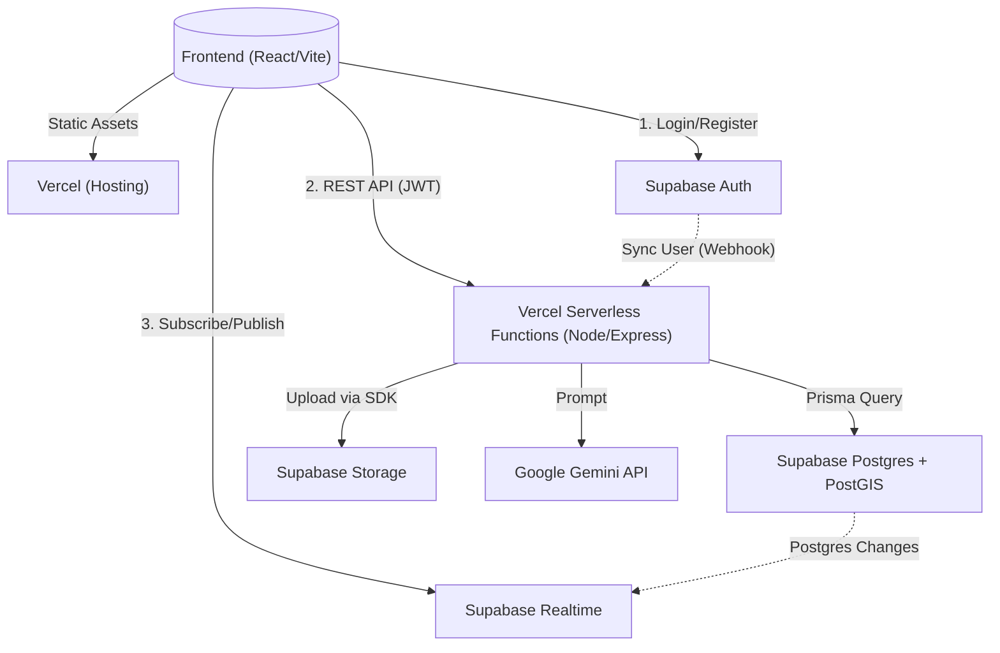
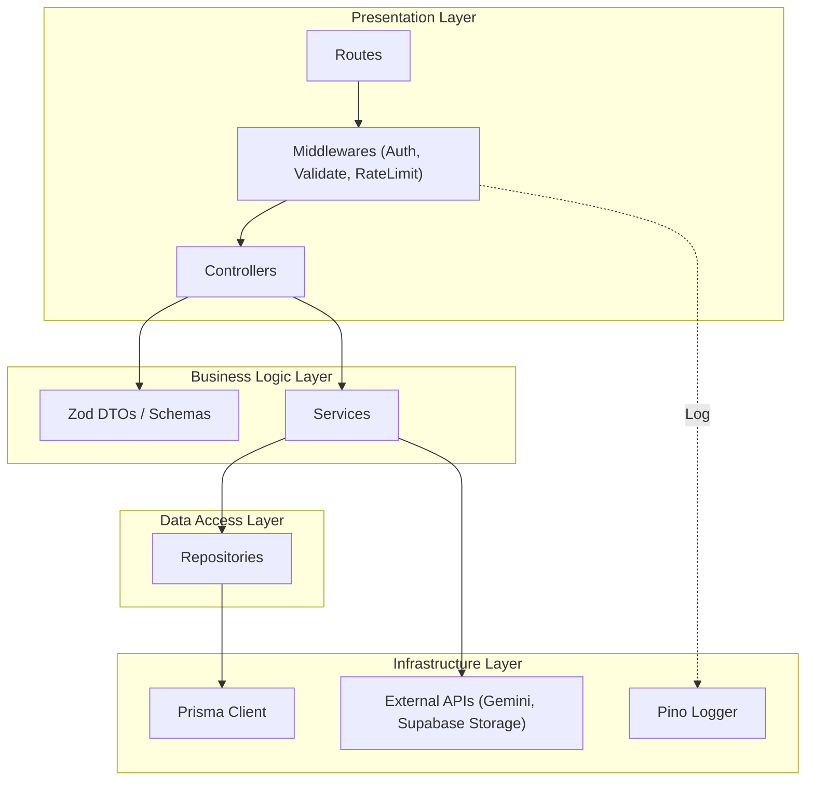
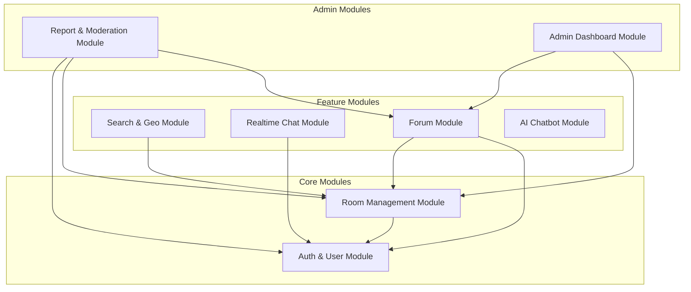
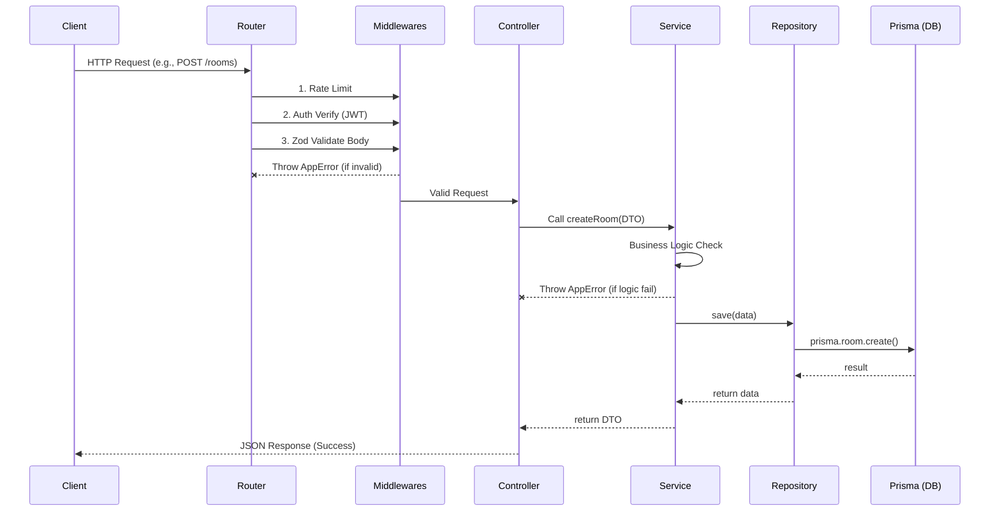
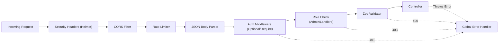
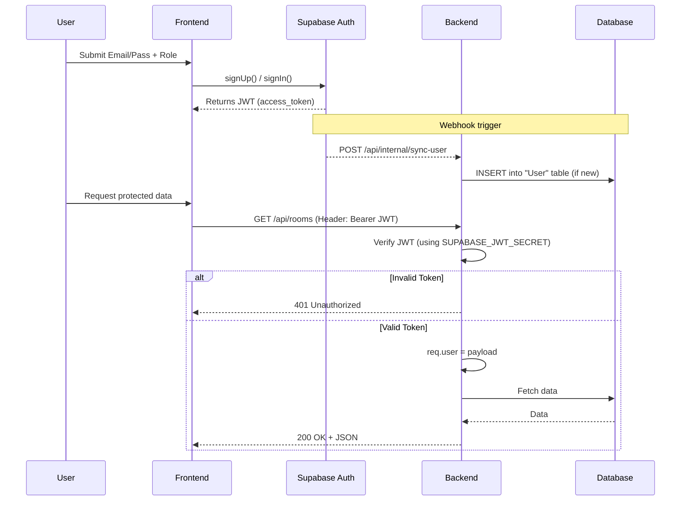
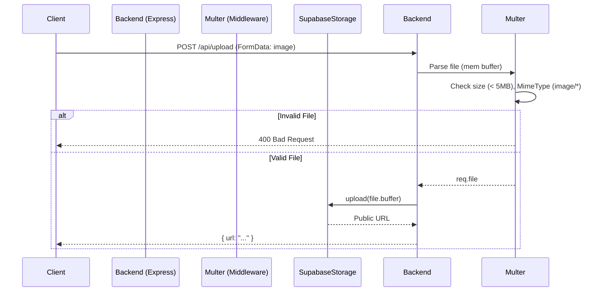
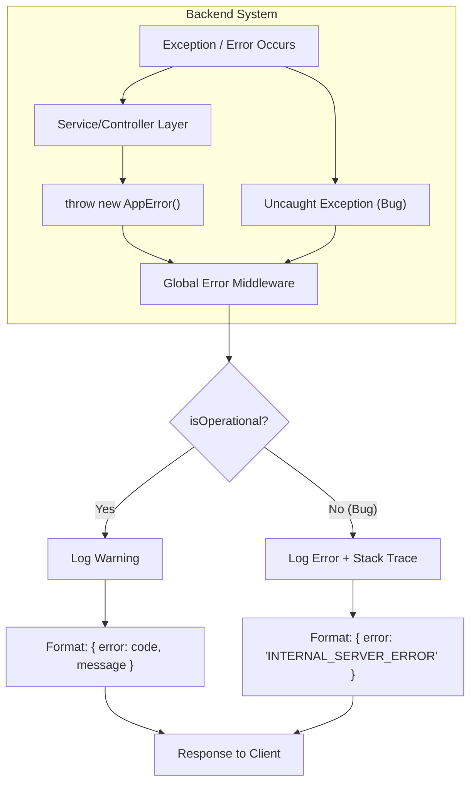
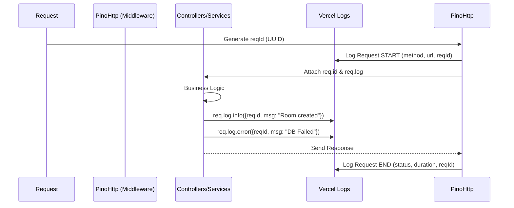

# TÀI LIỆU THIẾT KẾ KIẾN TRÚC PHẦN MỀM (SOFTWARE ARCHITECTURE DOCUMENT)

**Dự án:** Mạng xã hội tìm phòng trọ (Boarding Home Social Media)
**Phiên bản:** 1.0 (Dựa trên Project Plan V2)

Tài liệu này mô tả chi tiết kiến trúc phần mềm, cấu trúc thư mục, các luồng dữ liệu và thiết kế module của dự án. Mọi quyết định thiết kế đều được giải thích rõ ràng dựa trên các ràng buộc về quy mô (1 sinh viên, 13 tuần), công nghệ (Vercel, Supabase) và chi phí ($0).

---

## 1. Kiến trúc tổng thể (Overall Architecture)

Hệ thống được thiết kế theo mô hình **Client-Server** với **Serverless Backend**. Frontend và Backend giao tiếp qua REST API. Các tính năng realtime được xử lý trực tiếp giữa Client và Supabase.



### 💡 Các quyết định thiết kế và Lý do:
1. **Tách biệt Data Layer và Realtime Layer**: Frontend giao tiếp trực tiếp với Supabase Realtime cho tính năng Chat thay vì đi qua Backend.
   - *Lý do:* Vercel Serverless là môi trường stateless, không duy trì được kết nối WebSocket lâu dài. Dùng Supabase Realtime (đã có trong hệ sinh thái) giúp giải quyết bài toán realtime mà vẫn giữ được chi phí $0 và tương thích Vercel.
2. **Xác thực phi tập trung (Decentralized Auth)**: Supabase Auth quản lý quá trình đăng nhập và cấp phát JWT. Backend chỉ làm nhiệm vụ Verify JWT.
   - *Lý do:* Giảm thiểu rủi ro bảo mật do tự viết cơ chế cấp phát token, giảm khối lượng code backend (không cần viết forgot password, reset password flow).

---

## 2. Backend Architecture

Backend áp dụng **Layered Architecture (Kiến trúc phân tầng)**, tương tự mẫu thiết kế MVC nhưng tách biệt tầng Data Access (Repository).



### 💡 Các quyết định thiết kế và Lý do:
1. **Tách Repository Layer thay vì gọi thẳng Prisma trong Service**:
   - *Lý do:* Tăng tính độc lập (Separation of Concerns). Service chỉ chứa logic nghiệp vụ, Repository chứa logic truy vấn DB. Giúp unit test dễ dàng hơn (mock repository thay vì mock Prisma client).
2. **Zod Validation ở Controller Layer**:
   - *Lý do:* Dữ liệu phải được làm sạch và xác thực trước khi đi vào Service. Tránh trường hợp Service phải xử lý dữ liệu rác. Schema Zod có thể share với Frontend.

---

## 3. Cấu trúc thư mục (Folder Structure)

Dự án sử dụng **Monorepo** với `pnpm workspace`, chia thành `client`, `server` và `shared`.

```text
boarding-home/
├── client/ (React + Vite)
│   ├── src/
│   │   ├── features/          # Gói gọn code theo tính năng (auth, rooms, chat)
│   │   ├── components/ui/     # Reusable components (shadcn/ui)
│   │   ├── hooks/             # Custom React Hooks
│   │   └── lib/               # Utility (api, supabase client)
│   └── ...
├── server/ (Node + Express)
│   ├── src/
│   │   ├── routes/            # Định nghĩa HTTP endpoints
│   │   ├── middlewares/       # Auth, Error, Rate Limiting
│   │   ├── controllers/       # Parse Request, trả Response
│   │   ├── services/          # Business logic
│   │   ├── repositories/      # Data access layer (Prisma wrappers)
│   │   ├── config/            # Env, CORS setups
│   │   └── utils/             # Logger, AppError
│   └── prisma/
│       └── schema.prisma      # DB Schema
└── shared/ (Shared Code)
    ├── schemas/               # Zod schemas (dùng chung FE/BE)
    └── types/                 # TypeScript interfaces/enums
```

### 💡 Các quyết định thiết kế và Lý do:
1. **Feature-based structure ở Frontend (`src/features/`)**:
   - *Lý do:* Giúp quản lý code dễ dàng khi dự án phình to. Mã nguồn liên quan đến một tính năng (VD: Chat) sẽ nằm chung một chỗ (components, hooks, api calls) thay vì phân tán theo loại file (tất cả components vào `src/components`, tất cả hooks vào `src/hooks`).
2. **Shared folder**:
   - *Lý do:* Tránh lặp lại code (DRY - Don't Repeat Yourself). Validation logic (Zod) cho form đăng ký ở Frontend cũng chính là validation logic cho API tạo user ở Backend.

---

## 4. Module Diagram

Các module chính của hệ thống và sự tương tác giữa chúng.



### 💡 Các quyết định thiết kế và Lý do:
1. **Auth & User là Module gốc**: Mọi module khác đều phụ thuộc vào nó (để lấy UserID, xác thực Role).
2. **Tách biệt Report và Stats thành Admin Modules**:
   - *Lý do:* Phân quyền truy cập. Code liên quan đến Admin sẽ không trộn lẫn vào code public, giúp bảo mật hơn và có thể áp dụng middleware kiểm tra quyền Admin (`role === 'ADMIN'`) một cách chặt chẽ.

---

## 5. Request Flow (Luồng xử lý API chung)

Mô tả vòng đời của một HTTP Request khi đi vào Backend.



### 💡 Các quyết định thiết kế và Lý do:
- **Nguyên tắc "Fail Fast"**: Các Middleware nằm ngay cửa ngõ. Nếu token sai, format dữ liệu sai, hoặc request quá nhanh (Rate Limit) thì hệ thống từ chối ngay lập tức, không tốn tài nguyên chạy Controller hay Service.

---

## 6. Middleware Flow

Sắp xếp thứ tự thực thi của các Middlewares rất quan trọng để đảm bảo an toàn và hiệu suất.



### 💡 Các quyết định thiết kế và Lý do:
1. **Helmet và CORS chạy đầu tiên**: Chặn các request không hợp lệ từ các domain lạ hoặc thiếu security headers ngay từ vòng gửi xe.
2. **Body Parser trước Auth**: Một số trường hợp cần parse body để log, nhưng Auth vẫn nên chạy trước Zod Validator để tránh tốn CPU validate dữ liệu của một request chưa xác thực.
3. **Global Error Handler nằm cuối cùng**: Hứng mọi lỗi (AppError) được ném ra từ bất kỳ đâu trong chuỗi (Middleware, Controller, Service) để trả về format JSON chuẩn nhất định (`{ success: false, error: ... }`).

---

## 7. Authentication Flow (Luồng Xác thực)

Dự án dùng cơ chế Xác thực lai (Hybrid Auth) với Supabase.



### 💡 Các quyết định thiết kế và Lý do:
- **Webhook Sync User**: Bảng `auth.users` do Supabase quản lý nội bộ. Ta cần bảng `public."User"` để liên kết khoá ngoại (Foreign Key) với phòng trọ, bài đăng. Dùng Webhook đảm bảo cứ có user đăng ký thành công bên Auth là Backend tự động tạo record bên DB.
- **Verify token tại Backend**: Không cần gọi API check token tới Supabase. Backend chỉ dùng thư viện `jsonwebtoken` và Secret Key để giải mã. Giảm latency (độ trễ) cực lớn.

---

## 8. Upload Flow (Luồng Tải File)

Cho việc upload hình ảnh phòng trọ, avatar.



### 💡 Các quyết định thiết kế và Lý do:
- **Upload qua Backend thay vì upload thẳng từ Frontend lên Supabase**:
  - Mặc dù Supabase hỗ trợ upload thẳng, nhưng đẩy qua Backend giúp ta dễ dàng kiểm soát kích thước file, nén file (nếu thêm thư viện sharp sau này), và không phụ thuộc vào cấu hình Row Level Security (RLS) phức tạp của Supabase Storage.
  - Vercel Serverless có giới hạn payload (4.5MB), nên set max file size 4MB. Phù hợp vì ảnh phòng trọ không cần quá lớn.

---

## 9. Error Handling Flow (Luồng Xử lý Lỗi)

Đảm bảo Client luôn nhận được thông báo lỗi có cấu trúc.



### 💡 Các quyết định thiết kế và Lý do:
- **Phân biệt Operational Error và Programming Bug**:
  - Operational Error (ví dụ: Không tìm thấy phòng, sai mật khẩu) là các lỗi nằm trong dự tính $\rightarrow$ Trả về mã lỗi rõ ràng cho FE xử lý.
  - Programming Bug (ví dụ: `Cannot read property X of undefined`) là lỗi code $\rightarrow$ Không bao giờ trả chi tiết lỗi (stack trace) cho Client ở môi trường Production để tránh lộ thông tin hệ thống. Chỉ trả 500.

---

## 10. Logging Flow (Luồng Ghi Log)

Sử dụng `pino` để ghi log cấu trúc JSON.



### 💡 Các quyết định thiết kế và Lý do:
- **Request ID (Correlation ID)**: Gắn 1 UUID duy nhất cho mỗi Request. Khi đọc log trên Vercel, ta có thể filter theo Request ID để xem toàn bộ hành trình của request đó từ lúc vào đến lúc ra, cực kỳ hữu ích khi debug hệ thống phân tán.
- **Log ra Stdout**: Vercel Serverless sẽ tự động thu thập mọi thứ in ra stdout/stderr. Do đó cấu hình Pino xuất JSON ra stdout là cách integrate đơn giản và hiệu quả nhất với Vercel.

---

## 11. Dependency giữa các module (Module Dependencies)

Bảng phân tích sự phụ thuộc để quyết định thứ tự code (Code cái nào trước, cái nào sau).

| Module | Phụ thuộc vào (Depends on) | Mức ưu tiên Code | Ghi chú |
|--------|--------------------------|------------------|---------|
| **Shared (Schemas/Types)** | *Không* | Cao nhất (1) | Nền tảng cho cả FE/BE. |
| **Auth & User** | Shared | Rất cao (2) | Cung cấp định danh cho các thao tác tiếp theo. |
| **Room Management**| Auth, Shared | Cao (3) | Core domain của ứng dụng. Cần UserID để gán `ownerId`. |
| **Search & Geo** | Room Management | Trung bình (4) | Cần có dữ liệu Phòng trọ mới có cái để Search. |
| **Realtime Chat** | Auth | Trung bình (5) | Cần 2 User. Tương đối độc lập với Room. |
| **Forum** | Auth, Room Management | Thấp (6) | Cần User đăng bài. Có thể cần RoomID nếu là bài chia sẻ phòng. |
| **Report & Moderation** | Auth, Room, Forum | Thấp (7) | Cần có thực thể (Room/Post/User) để Report. |
| **Admin Dashboard** | Tất cả ở trên | Thấp nhất (8) | Thống kê số liệu từ tất cả các module khác. |

### 💡 Các quyết định thiết kế và Lý do:
- **Luôn code theo đồ thị phụ thuộc (Dependency Graph)**: Code từ module ít phụ thuộc nhất (Shared, Auth) lên các module phụ thuộc nhiều nhất (Admin). Nếu làm ngược lại, bạn sẽ phải dùng dữ liệu giả (mock data) liên tục, dẫn đến code phải sửa đi sửa lại nhiều lần khi tích hợp thực tế. Mức độ ưu tiên này phản ánh chính xác MVP Definition trong Project Plan V2.
